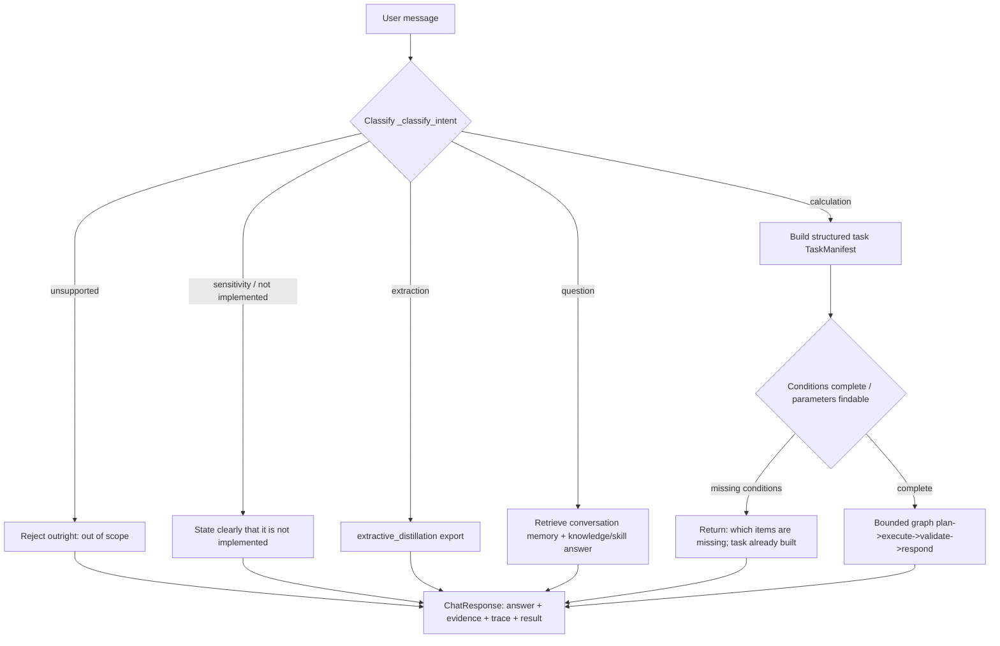

# Agent method architecture and flow

This document explains, in plain language plus a couple of diagrams, the method (orchestration)
architecture inside the `agent/` directory, and how one incoming message becomes a result step by
step.

> You can jump straight to the two flow diagrams in section 4 (Mermaid plus a text version) and come
> back to the earlier sections for detail.

---

## 1. One-sentence summary

The agent is a **"router + executor"**. An incoming user message is first classified into a **request
type** (the "intent"), and each type follows its own path: either a direct answer, or the message is
turned into a **structured calculation task**, handed to a tool to compute, independently validated,
and finally rendered as a human-readable answer.

The key principle: **the LLM only "understands the message, explains, and picks tools" — it never
computes phase-equilibrium numbers itself**. Every number comes from `thermo_engine` and passes
independent validation.

---

## 2. Core entry point: `ConversationOrchestrator`

`ConversationOrchestrator` in `agent/orchestrator.py` is the **main entry point**. Its two main
public methods:

- `chat(message, conversation_id) -> ChatResponse` — the main chat flow, handling one message.
- `parse(message, conversation_id) -> (intent, task)` — parsing only, returning "intent + task
  structure", exposed separately by the API layer (`/api/tasks/parse`).

### 2.1 What it holds

| Component | File | What it does |
|------|------|--------|
| Intent classifier | `providers.py` | Decides whether the message is a calculation / question / extraction / unsupported request |
| Task construction | `providers.py` | Turns the message into a `TaskManifest` (a structured task) |
| Bounded execution graph | `graph_workflow.py` | The standard four calculation steps: plan, execute, validate, respond |
| Tool registry | `tools.py` | The deterministic tools that may be called (phase equilibrium, etc.) |
| Conversation memory | `memory_integration.py`, `conversation_memory.py` | Remembers previous turns and parameters |
| Knowledge Q&A | `skill_integration.py` | Canned answers for concept and process-design questions |
| Extraction export | `extractive_distillation.py` | Recognises extraction requests and arranges DWSIM export |
| Model selection | `router.py` | Chooses which thermodynamic model to use, with exclusion reasons and scoring |

---

## 3. Pre-processing: how intent is confirmed "twice"

`chat()` starts by calling `_classify_intent()`. It does not look once but **deliberately
cross-checks rules against the LLM**, to prevent the model from hallucinating or the rules from
missing a case:

```text
Rule classifier DetermineProvider.classify_intent(message)
        │
        ▼ (produces a result first)
LLM classifier provider.classify_intent(message)
        (if the LLM is unavailable, trust the rule result)
        │
        ▼
Cross-check:
  · On disagreement, take whichever is more reliable — e.g. if the rules said
    "unsupported", or the intent needs an explicit keyword, trust the rules;
  · If the LLM says "calculation" but no components were mentioned at all,
    reject it and fall back to the rules.
        ▼
Final intent
```

Conclusion: **specialised intents (parameter lookup, process design, extraction, sensitivity
analysis, and so on) require an explicit trigger word** and only proceed when the rules detect it.
The LLM cannot invent them on its own.

### 3.1 All intents (`Intent` in `schemas/domain.py`)

| Intent | Meaning | Where it goes |
|------|------|--------|
| `EQUILIBRIUM_CALCULATION` | A phase-equilibrium calculation | The bounded execution graph |
| `TASK_CORRECTION` | Change one condition of a previous task (pressure/temperature) | Rebuild from the old task |
| `EXTRACTIVE_DISTILLATION` | Extractive distillation | `extractive_distillation.py` + DWSIM export |
| `CONCEPT_QA` and others (concept / model selection / parameters / data / process / result interpretation / process design) | Question answering | Memory + knowledge answers (skill) |
| `SENSITIVITY_ANALYSIS` | Sensitivity analysis | Not implemented yet (Phase 4); stated explicitly |
| `UNSUPPORTED_TASK` | Beyond supported scope (electrolytes, polymers, ...) | Rejected outright |

---

## 4. Overall flow diagram

### 4.1 Main flow (Mermaid)



### 4.2 Inside a calculation task (the bounded graph in `graph_workflow.py`)

```text
            ┌─────────────────────────────────────────────┐
    START ─► │ plan                                        │
            │   pick a tool from the allowlist             │
            └──────────────────────┬──────────────────────┘
                                   ▼
            ┌─────────────────────────────────────────────┐
            │ execute                                     │
            │   really compute using deterministic         │
            │   thermo_engine tools                        │
            └──────────────────────┬──────────────────────┘
                                   ▼
            ┌─────────────────────────────────────────────┐
            │ validate (independent)                      │
            │   check composition, material balance,       │
            │   equilibrium residual, convergence,         │
            │   phase stability                            │
            └──────────────────────┬──────────────────────┘
                                   ▼
            ┌─────────────────────────────────────────────┐
            │ respond                                     │
            │   the LLM may only explain "the computed     │
            │   result plus the validation conclusion"     │
            └──────────────────────┬──────────────────────┘
                                   ▼
                                  END
```

The four steps run strictly in order with no extra round trips in between (hence "bounded" — the LLM
cannot loop and rewrite turns by itself).

---

## 5. What each step does, in code

### 5.1 `chat()` (orchestrator.py, from around line 1077)

Roughly in order:
1. Get or create conversation state `state` (the `states` dict keyed by `conversation_id`).
2. `_classify_intent()` to obtain `intent`.
3. Branch on `intent`:
   - **Unsupported** → answer directly that electrolytes/polymers/... are not supported.
   - **Extraction** → call `run_extractive_export` to produce a DWSIM file and return a payload
     carrying `extractive`.
   - **Question** → retrieve memory plus `answer_with_skill_payload` /
     `provider.answer_with_evidence`.
   - **Calculation** → continue to step 4.
4. Calculation: use `provider.formulate_task` to turn the message into a `TaskManifest`; on failure
   fall back to `DeterministicProvider`, and if that also fails return "could not build the task".
5. Fill in parameters: `_merge_parameter_sets` (externally supplied, or looked up automatically from
   the production parameters via `/auto_lookup_parameters`).
6. Infer a missing temperature: `_infer_temperature_from_context` (from earlier run results).
7. Check what is missing: `_missing_conditions`; if anything is missing, return "missing xxx".
8. Once complete: `graph.run(message, task)` runs the four steps and yields
   `envelope/statements/steps`.
9. Save conversation memory (`save_turn`) and assemble the returned `ChatResponse`.

### 5.2 `_prepare_task` and `_align_task_components`

These **normalise** the `TaskManifest` the model produced: unify component case and aliases, align
against the component database, and bring feed composition / pressure / temperature into standard
units (kPa, K).

### 5.3 The bounded graph (`graph_workflow.py`)

- `plan`: `provider.select_tool` picks one tool from the tool registry (usually the phase-equilibrium
  tool).
- `execute`: `tools.execute(tool_name, task)` → the real computation.
- `validate`: `validate_task_execution` performs the independent physical validation (this is what
  AGENTS.md means by "a solver status is not physical validation").
- `respond`: `provider.interpret_result` lets the LLM explain the already-computed result; it is given
  only the result and the validation, so it cannot invent numbers.

---

## 6. Conversation memory

`save_turn` / `retrieve_for_calculation` / `retrieve_for_concept_qa` in `memory_integration.py` are
responsible for:
- Remembering each turn (message, answer, intent, components, task summary).
- Referencing a previous run when the user later asks about "the result".
- Prefixing concept questions with the relevant history as context.

---

## 7. Safety and boundaries

- **Deterministic first**: when the LLM is unavailable or its output is invalid, fall back to
  `DeterministicProvider`, the rules, or a canned skill answer.
- **Hard failure on missing parameters**: without binary parameters the system returns
  `missing_parameters` and never fabricates them.
- **No tools outside the allowlist**: the execution graph may only pick tools listed in
  `tools.catalog()`, which keeps the LLM on a leash.
- **Rejection beyond scope**: electrolytes, polymers, SLE, VLLE and full distillation-column design
  are explicitly rejected in version 0.1.

---

## 8. Related files quick reference

| File | Purpose |
|------|------|
| `orchestrator.py` | Overall orchestration: `chat` / `parse` / `_classify_intent` |
| `providers.py` | Providers (deterministic / DeepSeek / OpenAI) for intent classification, task construction, explanation and tool selection |
| `graph_workflow.py` | The bounded execution graph: plan -> execute -> validate -> respond |
| `tools.py` | Engineering tool registry (the deterministic tools that may be called) |
| `router.py` | Hard-rule exclusions plus explainable model recommendation scoring |
| `extractive_distillation.py` | Extraction intent handling and DWSIM export orchestration |
| `memory_integration.py` / `conversation_memory.py` | Conversation memory read/write |
| `skill_integration.py` | Canned answers for concept and process-design questions |
| `executor.py` | Tool execution result wrapping plus the validation entry point |
