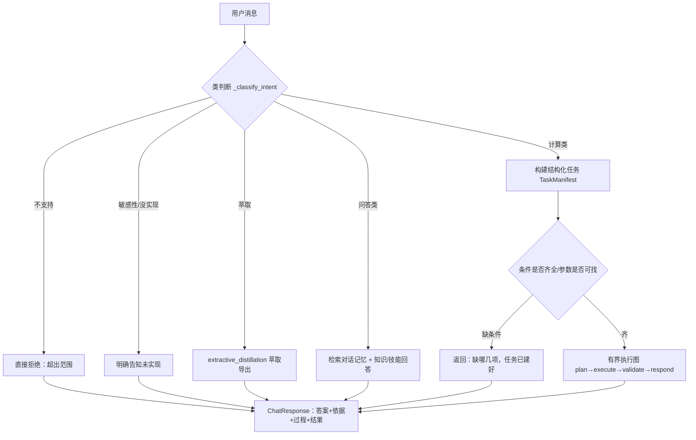

# Agent 方法架构与流程说明

本文件用大白话 + 一两个图，说明 `agent/` 目录里的方法（编排）架构，以及一条话进来后
是怎么一步步变成结果的。

> 你可以直接看第 4 节的两张流程图（Mermaid + 文字版），需要细节再看前几节。

---

## 1. 一句话概括

Agent 是一个"**分流器 + 执行器**"。用户的话进来，先判断是**哪类请求**（叫"意图"），
然后按类型走对应的路：要么直接问答，要么把话整理成**结构化计算任务**，扔给工具去算，
算完再做独立校验，最后生成人能读的回答。

关键的原则：**大模型只负责"听懂话、做解释、挑工具"，从来不自己算相平衡数**。
所有数值都来自 `thermo_engine`，并经过独立校验。

---

## 2. 核心入口：`ConversationOrchestrator`

`agent/orchestrator.py` 里的 `ConversationOrchestrator` 是**总入口**。它的两个主要对外方法：

- `chat(message, conversation_id) -> ChatResponse` —— 聊天主流程，处理一条消息。
- `parse(message, conversation_id) -> (intent, task)` —— 只做解析，返回"意图 + 任务结构"，
  API 层单独暴露（`/api/tasks/parse`）。

### 2.1 它手里握着哪些东西

| 部件 | 文件 | 干什么 |
|------|------|--------|
| 意图判断器 | `providers.py` | 判断话是"计算/问答/萃取/不支持…"哪一类 |
| 任务构建 | `providers.py` | 把话整理成 `TaskManifest`（结构化任务） |
| 有界执行图 | `graph_workflow.py` | 计算的标准四步：计划→执行→校验→回应 |
| 工具注册表 | `tools.py` | 能调用的确定性工具（相平衡等） |
| 对话记忆 | `memory_integration.py`、`conversation_memory.py` | 记住之前几轮、参数 |
| 知识问答 | `skill_integration.py` | 概念/流程设计类问答的固定回答 |
| 萃取导出 | `extractive_distillation.py` | 识别萃取请求并安排 DWSIM 导出 |
| 模型选择 | `router.py` | 挑用哪个热力学模型、给排除原因和打分 |

---

## 3. 预处理：意图是怎样"双重"确认的

`chat()` 一开始调用 `_classify_intent()`。它不只看一次，而是**有意 + 规则交叉确认**，
防止大模型胡说、或规则漏判：

```text
规则分类器 DetermineProvider.classify_intent(message)
        │
        ▼（先出结果）
大模型分类器 provider.classify_intent(message)（若大模型不可用，就信任规则的结果）
        │
        ▼
交叉对账：
  · 两者不一致时按"谁更可靠"取 — 例如规则判了"不支持"或需要明确关键词的意图，
    就信任规则；
  · 大模型说"计算"但根本没提组分 → 不认，退回规则。
        ▼
得到最终 intent
```

结论：**专门意图（参数查询、流程设计、萃取、敏感性分析等）必须有明确触发词**，规则
判到了才走，大模型自己脑补的不算。

### 3.1 所有意图（`schemas/domain.py` 的 `Intent`）

| 意图 | 含义 | 走哪里 |
|------|------|--------|
| `EQUILIBRIUM_CALCULATION` | 要做相平衡计算 | 有界执行图 |
| `TASK_CORRECTION` | 改之前任务的某条件（改压/改温） | 沿用旧任务重建 |
| `EXTRACTIVE_DISTILLATION` | 萃取精馏 | `extractive_distillation.py` + DWSIM 导出 |
| `CONCEPT_QA` 等（概念/模型选择/参数/数据/工艺/结果解读/流程设计） | 问答类 | 记忆 + 知识回答（skill） |
| `SENSITIVITY_ANALYSIS` | 敏感性分析 | 暂未做（Phase 4），明确告知 |
| `UNSUPPORTED_TASK` | 超出支持范围（电解质、聚合物…） | 直接拒绝 |

---

## 4. 流程总图

### 4.1 主流程（Mermaid）



### 4.2 计算任务内部（有界执行图 `graph_workflow.py`）

```text
            ┌─────────────────────────────────────────────┐
    START ─► │ plan（计划）                                │
            │   挑一个"允许名单"里的工具                   │
            └──────────────────────┬──────────────────────┘
                                   ▼
            ┌─────────────────────────────────────────────┐
            │ execute（执行）                              │
            │   用确定性的 thermo_engine 工具真实计算       │
            └──────────────────────┬──────────────────────┘
                                   ▼
            ┌─────────────────────────────────────────────┐
            │ validate（独立校验）                         │
            │   检查组成、物料平衡、平衡残差、收敛、相稳定   │
            └──────────────────────┬──────────────────────┘
                                   ▼
            ┌─────────────────────────────────────────────┐
            │ respond（回应）                              │
            │   大模型只能解释"已算出的结果+校验结论"       │
            └──────────────────────┬──────────────────────┘
                                   ▼
                                  END
```

四步严格按顺序，中间没有多余的来回（所以叫"有界"——不会让大模型自己反复改轮）。

---

## 5. 各步在做什么，看代码

### 5.1 `chat()`（orchestrator.py，约 1077 行起）

大致顺序：
1. 取/建对话状态 `state`（`states` 字典按 `conversation_id` 存）。
2. `_classify_intent()` 得到 `intent`。
3. 按 `intent` 分流：
   - **不支持** → 直接回答"不支持电解质/聚合物…"。
   - **萃取** → 调 `run_extractive_export` 出 DWSIM 文件，返回带 `extractive` 载荷。
   - **问答类** → 检索记忆 + `answer_with_skill_payload` / `provider.answer_with_evidence`。
   - **计算类** → 往下继续第 4 步。
4. 计算类：用 `provider.formulate_task` 把话变成 `TaskManifest`；失败时退回
   `DeterministicProvider`，再不行就返回"没能构建任务"。
5. 补参数：`_merge_parameter_sets`（外部给的 / 自动从生产参数查 `/auto_lookup_parameters`）。
6. 推论缺失温度：`_infer_temperature_from_context`（从之前的运行结果推断）。
7. 检查缺什么条件：`_missing_conditions`，缺就返回"缺 xxx"。
8. 都齐了：`graph.run(message, task)` 跑那四步，得到 `envelope/statements/steps`。
9. 存对话记忆（`save_turn`），组装 `ChatResponse` 返回。

### 5.2 `_prepare_task` 与 `_align_task_components`

把模型给的 `TaskManifest` **规范化**：统一组分大小写/别名、按组分数据库对齐、
把"进料组成/压力/温度"规整到标准单位（kPa、K）。

### 5.3 有界执行图（`graph_workflow.py`）

- `plan`：`provider.select_tool` 从工具注册表里挑一个（通常就是相平衡工具）。
- `execute`：`tools.execute(tool_name, task)` → 真算。
- `validate`：`validate_task_execution` 做独立物理校验（这就是 AGENTS.md 里说的
  "solver 状态不算物理校验"）。
- `respond`：`provider.interpret_result` 让大模型解释"已算出的结果"，只给结果+校验，
  不让它瞎编数。

---

## 6. 对话记忆

`memory_integration.py` 的 `save_turn` / `retrieve_for_calculation` / `retrieve_for_concept_qa`
负责：
- 记住每轮（消息、答案、意图、组分、任务摘要）。
- 算完再问"结果"时，能引用之前那次运行。
- 问概念时，把相关历史作为上下文前缀拼给回答。

---

## 7. 安全与边界

- **确定性优先**：大模型不可用或输出不合法时，退回 `DeterministicProvider` / 规则 / 固定技能回答。
- **缺参数硬失败**：没有二元参数就返回 `missing_parameters`，绝不瞎编。
- **不允许名单外的工具**：执行图只能在 `tools.catalog()` 允许名单里挑工具，限制大模型放手。
- **超出 scope 拒绝**：电解质、聚合物、SLE、VLLE、完整精馏塔设计等在 0.1 版本明确拒绝。

---

## 8. 相关文件速查

| 文件 | 作用 |
|------|------|
| `orchestrator.py` | 总编排：`chat` / `parse` / `_classify_intent` |
| `providers.py` | 意图判断、任务构建、解释、工具选择的 Provider（确定性/DeepSeek/OpenAI） |
| `graph_workflow.py` | 有界执行图：plan→execute→validate→respond |
| `tools.py` | 工程工具注册表（可调用的确定性工具） |
| `router.py` | 硬规则排除 + 可解释的模型推荐打分 |
| `extractive_distillation.py` | 萃取意图处理 + DWSIM 导出编排 |
| `memory_integration.py` / `conversation_memory.py` | 对话记忆存取 |
| `skill_integration.py` | 概念/流程设计类问答的固定回答 |
| `executor.py` | 工具执行结果封装 + 校验入口 |
