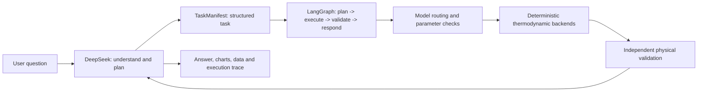

# Agent "thinking + execution" architecture

## Conclusion

The project implements a **constrained "thinking + execution" agent**:

- **DeepSeek thinks**: it recognises intent, produces a structured task, selects tools, and explains results.
- **The deterministic core executes**: it calls thermodynamic models to solve phase equilibrium. The LLM is never allowed to generate calculation values directly.
- **The validator gates**: it checks composition, material balance, equilibrium residuals, convergence, parameter applicability, and phase-stability evidence.

## Current implementation

| Module | Current responsibility |
|---|---|
| DeepSeek Provider | Question answering, intent classification, task structuring, tool selection, result explanation |
| LangGraph Agent | Fixed `plan -> execute -> validate -> respond` execution |
| Model routing | Filters by equilibrium task, system, pressure, parameter availability and model status |
| Backend registry | Switches between thermodynamic backends behind one interface |
| Parameters and evidence | Returns `missing_parameters` when binary parameters are absent; never fabricates them |
| Validator | Independently checks that numerical results satisfy physical constraints |

## Model integration status

| Model / framework | Status |
|---|---|
| Ideal/Raoult | Implemented, executable |
| CalebBell/thermo + Peng-Robinson | Implemented, executable |
| Phasepy + Peng-Robinson | Integrated, executable once optional dependencies are installed |
| Clapeyron.jl + Peng-Robinson | Integrated, executable once Julia initialises successfully |
| Wilson | Model contract only; no production solver backend yet |
| NRTL | VLE/LLE contract only; production parameter store and solver backend missing |
| UNIQUAC | VLE/LLE contract only; production parameter store and solver backend missing |

The project therefore has a **general agent shell and a multi-backend interface in place**, but it cannot yet claim to have integrated every phase-equilibrium model in the field.

## Model selection principles

DeepSeek may propose a model, but execution must always pass deterministic rules:

1. Exclude tasks this version does not support: electrolytes, reactive equilibrium, SLE, VLLE.
2. Check whether the model supports the target phase and calculation type.
3. Check the system, pressure range, association risk and extrapolation risk.
4. Check that pure properties and binary interaction parameters exist and carry a source.
5. Only backends that are implemented **and** have complete parameters may execute.

Routing already has this framework, but its applicability knowledge remains basic: it does not yet cover the full range of activity-coefficient models, further equations of state, SAFT-family models, or complete LLE/VLLE stability analysis.

## Next steps

1. Implement the Wilson, NRTL and UNIQUAC backends together with a traceable binary parameter store.
2. Continue integrating EOS, SAFT and corresponding-states models, plus further Phasepy/Clapeyron models, behind the unified backend interface.
3. Turn model applicability into reviewable rules and model cards rather than leaving it to free LLM judgement.
4. Add behavioural tests at the public calculation entry point and independent physical validation for every new model.

The target architecture is not "DeepSeek replaces thermodynamic software", but:

> **DeepSeek understands and orchestrates, a professional thermodynamic framework calculates, and an independent validator confirms the result is trustworthy.**
