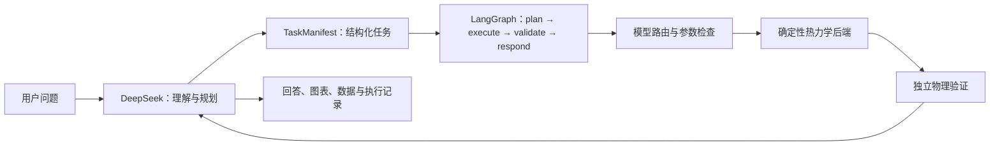

# Agent“思考 + 执行”架构说明

## 结论

当前项目已经实现了一个**受约束的“思考 + 执行”Agent**：

- **DeepSeek 负责思考**：识别意图、生成结构化任务、选择工具和解释结果。
- **确定性内核负责执行**：调用热力学模型求解相平衡，不允许 LLM 直接生成计算数值。
- **验证器负责把关**：检查组成、物料衡算、相平衡残差、收敛性、参数适用性和相稳定性证据。

## 当前实现

| 模块 | 当前职责 |
|---|---|
| DeepSeek Provider | 问答、意图分类、任务结构化、工具选择、结果解释 |
| LangGraph Agent | 固定执行 `plan → execute → validate → respond` |
| 模型路由 | 根据相态任务、物系、压力、参数可用性和模型状态进行筛选 |
| 后端注册表 | 通过统一接口切换不同热力学后端 |
| 参数与证据 | 缺少二元参数时返回 `missing_parameters`，不使用虚构参数 |
| 验证器 | 独立检查数值结果是否满足物理约束 |

## 模型整合状态

| 模型/框架 | 状态 |
|---|---|
| Ideal/Raoult | 已实现，可执行 |
| CalebBell/thermo + Peng–Robinson | 已实现，可执行 |
| Phasepy + Peng–Robinson | 已接入，安装可选依赖后可执行 |
| Clapeyron.jl + Peng–Robinson | 已接入，Julia 初始化成功后可执行 |
| Wilson | 仅模型契约，尚无生产求解后端 |
| NRTL | 仅 VLE/LLE 契约，缺少生产参数库和求解后端 |
| UNIQUAC | 仅 VLE/LLE 契约，缺少生产参数库和求解后端 |

因此，项目的**通用 Agent 外壳和多后端接口已经形成**，但还不能称为“已经整合相平衡领域所有模型”。

## 模型选择原则

DeepSeek可以提出模型建议，但最终执行必须经过确定性规则：

1. 排除电解质、反应平衡、SLE、VLLE 等当前版本不支持的任务。
2. 检查模型是否支持目标相态和计算类型。
3. 检查物系、压力范围、缔合风险和外推风险。
4. 检查纯物性和二元交互参数是否存在且有来源。
5. 只有已实现且参数完整的后端才能执行。

当前路由已经具备上述框架，但适用性知识仍较基础，尚未覆盖完整的活度系数模型、更多状态方程、
SAFT 类模型和完整 LLE/VLLE 稳定性分析。

## 后续方向

1. 实现 Wilson、NRTL、UNIQUAC 后端及可追溯二元参数库。
2. 按统一后端接口继续接入 EOS、SAFT、状态关联模型和更多 Phasepy/Clapeyron 模型。
3. 将模型适用性整理成可审查的规则与模型卡，而不是交给 LLM 自由判断。
4. 为每个新模型增加公开计算入口的行为测试和独立物理验证。

目标架构不是“DeepSeek 替代热力学软件”，而是：

> **DeepSeek 负责理解与编排，专业热力学框架负责计算，独立验证器负责确认结果可信。**
