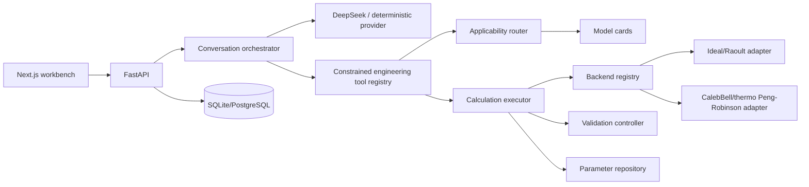

# Architecture

Only the deterministic backend emits thermodynamic numbers. API, agent, and UI exchange Pydantic
contracts and immutable run snapshots. Third-party engines can be added behind the backend protocol
without leaking their internal object model into the service layer.

The tool registry follows the useful boundary in CAi_copilot—reasoning chooses a named tool, while
the tool performs the operation—but deliberately exposes no shell or notebook execution. The
public execution trace contains only auditable phase summaries, never private chain-of-thought.
See [integrations.md](integrations.md) for the implementation matrix and extension contract.
