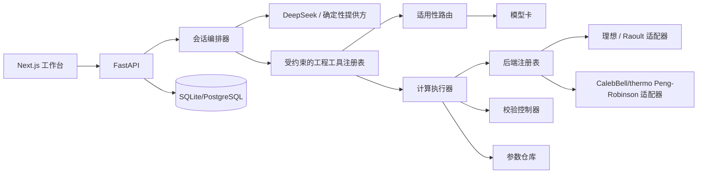

# 架构

只有确定性后端会产生热力学数值。API、Agent 与 UI 之间通过 Pydantic 契约和不可变的运行快照交换数据。第三方引擎可以挂到后端协议之下，而不把其内部对象模型泄漏到服务层。

工具注册表沿用了 CAi_copilot 中的有用边界——由推理选择具名工具，由工具执行操作——但**刻意不暴露**任何 shell 或 notebook 执行能力。公开的执行轨迹只包含可审计的相态摘要，绝不包含私有的思维链。

实现矩阵与扩展契约见 [integrations.zh-CN.md](integrations.zh-CN.md)。
